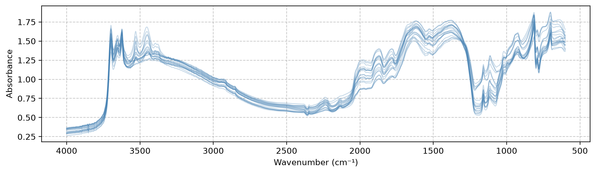

# SoilSpecData


<!-- WARNING: THIS FILE WAS AUTOGENERATED! DO NOT EDIT! -->

> Load the [Open Soil Spectral Library (OSSL)](https://explorer.soilspectroscopy.org/) as spectra and soil properties ready for machine learning.

OSSL is an open database of soil spectra, with the lab-measured soil properties of the same samples. Version 1.2 combines 10 spectral libraries, from the US KSSL library (86,603 samples) and the European LUCAS survey (40,175) to smaller regional ones. It holds 135,651 samples, with mid-infrared (MIR) spectra for 85,684 of them and visible and near-infrared (VISNIR) spectra for 64,644. OSSL publishes the whole database as one CSV file of about 1 GB.

SoilSpecData downloads and caches that file, and gives the spectra in wavenumbers. It aligns spectra with soil properties by sample. One line then gives you `X` and `y` for a model. The [OSSL documentation](https://docs.soilspectroscopy.org/) describes the database and how OSSL builds it.

The [SoilSpecData documentation](https://fr.anckalbi.net/soilspecdata/) covers the full API.

## Installation

``` sh
pip install -U soilspecdata
```

To install the development version, with the development tools nbdev and twine, run this in the project root:

``` sh
pip install -e .[dev]
```

## Features

- Download and cache the OSSL database, at data level `L0` or `L1`
- VISNIR (visible and near-infrared) and MIR (mid-infrared) spectra, in wavenumbers, for any wavenumber range
- Soil properties and metadata as pandas DataFrames, indexed by sample ID
- Spectra and target variables aligned by sample, ready for machine learning
- *Further datasets to come …*

## Quick start

Load OSSL, then get the MIR spectra and CEC values of every sample that has both. The first call downloads about 1 GB. Later calls read the cached file instead. Loading took 24 seconds on an Apple silicon Mac. Memory use peaks at about 12 GB while pandas reads the file. The loaded data then takes 3.5 GB:

``` python
from soilspecdata.datasets.ossl import load_ossl
```

``` python
ossl = load_ossl()
```

``` python
X, y, ids = ossl.mir().xy('cec_usda.a723_cmolc.kg')
X.shape, y.shape
```

    ((57062, 1701), (57062, 1))

## Loading the data

[`load_ossl()`](https://franckalbinet.github.io/soilspecdata/datasets.ossl.html#load_ossl) loads the `L0` data. `L0` keeps the lab method of each source dataset. `load_ossl(level='L1')` loads the `L1` data. `L1` converts properties measured with different lab methods to one target method.

[`load_ossl`](https://franckalbinet.github.io/soilspecdata/datasets.ossl.html#load_ossl) caches each downloaded file in `~/.soilspecdata/`, under the file’s own name, such as `ossl_all_L0_v1.2.csv.gz`. To download the file again:

``` python
ossl = load_ossl(force_download=True)
```

## Spectra

OSSL MIR spectra cover 600 to 4000 cm⁻¹. VISNIR spectra cover 350 to 2500 nm, or 4000 to 28571 cm⁻¹. `mir` and `visnir` return both in wavenumbers, in increasing order. They return only the samples with a value at every wavenumber in the range.

Their `wmin` and `wmax` parameters select a wavenumber range. By default, `mir` returns 600 to 4000 cm⁻¹, which covers all 85,684 MIR spectra. By default, `visnir` returns 4000 to 25000 cm⁻¹ (400 to 2500 nm). That range covers all 64,644 VISNIR spectra. Only 23,880 of them start at 350 nm.

The MIR spectra over the default range:

``` python
mir_data = ossl.mir()
```

The VISNIR spectra between 8000 and 25000 cm⁻¹:

``` python
visnir_data = ossl.visnir(wmin=8000, wmax=25000)
```

Both methods return a [`Spectra`](https://franckalbinet.github.io/soilspecdata/types.html#spectra), with these fields:

- `wavenumbers`: wavenumbers in cm⁻¹, in increasing order
- `spectra`: one row per sample, one column per wavenumber
- `measurement_type`: `ref` (reflectance) or `abs` (absorbance)
- `sample_ids`: the sample ID of each row

Printing a [`Spectra`](https://franckalbinet.github.io/soilspecdata/types.html#spectra) shows the start of each field:

``` python
print(visnir_data)
```

    Spectra attributes:
    ------------------
    Available attributes: wavenumbers, spectra, measurement_type, sample_ids

    Wavenumbers:
    -----------
    [8000, 8013, 8026, 8039, 8052, 8065, 8078, 8091, 8104, 8117]
    Shape: (426,)

    Spectra:
    -------
    [[0.4707, 0.4702, 0.4697, 0.4692, 0.4687],
     [0.6087, 0.6081, 0.6074, 0.6068, 0.6062],
     [0.6257, 0.625 , 0.6243, 0.6237, 0.6231],
     [0.6598, 0.6589, 0.6581, 0.6574, 0.6567],
     [0.6655, 0.6644, 0.6634, 0.6624, 0.6615]]
    Shape: (64644, 426)

    Measurement type (Reflectance or Absorbance):
    --------------------------------------------
    ref

    Sample IDs:
    ----------
    ['594ef6c549138844cf79a0fece6de7d2', '7417caf4328373c2f6b2977817f508b6',
     'e01efc61d0222fc5ca44656483dfa665', '5c1dcddd9cfe540857cc2bfea3d9a44b',
     '393ab838badfeb6e12520f09c83e479b', 'c8f162486487b8525403e55c00d60cfb',
     'e3b9c5d0e649e49726e1fed397f18417', 'c48a2a1f0cc04b26537e0c653530cbf2',
     'bf2ea7ea2964e7d0bd42443e095d1b56', '2507c34c14815cb6ec303e5bf9156072']
    Total samples: 64644

The first 20 MIR spectra, plotted with matplotlib:

``` python
from matplotlib import pyplot as plt

plt.figure(figsize=(12, 3))
plt.plot(mir_data.wavenumbers, mir_data.spectra[:20,:].T, alpha=0.3, color='steelblue', lw=1)
plt.gca().invert_xaxis()
plt.grid(True, linestyle='--', alpha=0.7)

plt.xlabel('Wavenumber (cm⁻¹)')
plt.ylabel('Absorbance');
```



## Soil properties and metadata

Selecting columns of `ossl` returns a `pd.DataFrame`, indexed by sample ID (`id`). Sample IDs are OSSL’s `id.layer_uuid_txt` values. They are unique across all source datasets. `dropna` keeps the samples that have a value. The CEC (cation exchange capacity) of every sample that has one, in cmolc/kg:

``` python
properties = ossl[['cec_usda.a723_cmolc.kg']].dropna()
```

``` python
properties.head()
```

<div>
<style scoped>
    .dataframe tbody tr th:only-of-type {
        vertical-align: middle;
    }
&#10;    .dataframe tbody tr th {
        vertical-align: top;
    }
&#10;    .dataframe thead th {
        text-align: right;
    }
</style>

|                                  | cec_usda.a723_cmolc.kg |
|----------------------------------|------------------------|
| id                               |                        |
| 3998362dd2659e2252cd7f38b43c9b1f | 6.633217               |
| 2bab4dbbac073b8648475ad50d40eb95 | 3.822628               |
| 29213d2193232be8867d85dec463ec00 | 3.427324               |
| 8b1ee9146c026faee20a40df86736864 | 1.906545               |
| 6e8e9d1105e7da7055555cb5d310df5f | 13.403203              |

</div>

Any column in `ossl.meta_cols` can serve as a target or as metadata. Soil-lab column names follow the pattern `<property>_<method>_<unit>`. For example, `cec_usda.a723_cmolc.kg` is the CEC measured with USDA method A723, in cmolc/kg. The [OSSL database description](https://docs.soilspectroscopy.org/db-desc.html) describes all the variables. To find the columns for one property, filter on its name:

``` python
[c for c in ossl.meta_cols if c.startswith('cec')]
```

    ['cec_iso.11260_cmolc.kg', 'cec_usda.a723_cmolc.kg']

Metadata such as coordinates can have missing values. Without `dropna`, the selection keeps every sample:

``` python
metadata = ossl[['longitude.point_wgs84_dd', 'latitude.point_wgs84_dd']]
```

## Selecting samples

`ossl` behaves like a pandas DataFrame indexed by sample ID. Filter samples with ordinary pandas conditions on its columns. The result supports every method above. The KSSL samples only:

``` python
kssl = ossl[ossl['dataset.code_ascii_txt'] == 'KSSL.SSL']
len(kssl), len(ossl)
```

    (86603, 135651)

## Training data

`xy` returns the spectra `X`, the targets `y` and the sample IDs `ids` of the samples that have both, in the same row order. It accepts several targets, and works on any selection of samples. The KSSL samples with both CEC and organic carbon values:

``` python
X, y, ids = kssl.mir().xy(['cec_usda.a723_cmolc.kg', 'oc_usda.c729_w.pct'])

X.shape, y.shape, ids.shape
```

    ((50825, 1701), (50825, 2), (50825,))

## Upgrading from 0.0.9

Version 0.0.10 changes the API:

- `get_ossl(url, force_download, level)` is now `load_ossl(level, url, force_download)`.
- `get_mir` and `get_visnir` are now `mir` and `visnir`.
- `ossl.get_aligned_data(spectra, targets)` is now `spectra.xy(targets)`.
- `ossl.get_properties(cols)` is now `ossl[cols]`. Add `.dropna()` for `require_complete=True`.
- `OSSLData`, `SpectraData` and `properties_cols` are now [`OSSL`](https://franckalbinet.github.io/soilspecdata/datasets.ossl.html#ossl), [`Spectra`](https://franckalbinet.github.io/soilspecdata/types.html#spectra) and `meta_cols`.
- `ossl.df` is indexed by sample ID (`id.layer_uuid_txt`) instead of by row number.

The old names still work in 0.0.10. The next release removes them. [`get_ossl`](https://franckalbinet.github.io/soilspecdata/datasets.ossl.html#get_ossl), `get_mir`, `get_visnir` and `get_aligned_data` also warn with a `DeprecationWarning`.

## Contributing

Contributions are welcome! Please feel free to submit a Pull Request.

## License

SoilSpecData is under the [Apache 2.0](LICENSE) licence.

OSSL publishes its data under [CC BY 4.0](https://creativecommons.org/licenses/by/4.0/), unless a dataset states otherwise. The `dataset.license.title_ascii_txt` column gives the licence of each source dataset. In v1.2, three datasets have their own licence:

- `LUCAS.SSL` and `LUCAS.WOODWELL.SSL`: JRC License Agreement
- `AFSIS1.SSL`: ODC Open Database License
- `AFSIS2.SSL`: CC0

Check these terms before you publish or share results that use those datasets.

## Citation(s)

- [OSSL Library](https://journals.plos.org/plosone/article?id=10.1371/journal.pone.0296545): Safanelli, J.L., Hengl, T., Parente, L.L., Minarik, R., Bloom, D.E., Todd-Brown, K., Gholizadeh, A., Mendes, W. de S., Sanderman, J., 2025. Open Soil Spectral Library (OSSL): Building reproducible soil calibration models through open development and community engagement. PLOS ONE 20, e0296545. https://doi.org/10.1371/journal.pone.0296545
- [SoilSpecData](https://github.com/franckalbinet/soilspecdata): Albinet, F., 2026. SoilSpecData, version 0.0.10. https://github.com/franckalbinet/soilspecdata
